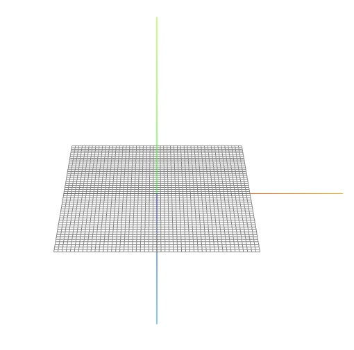
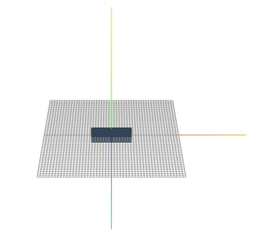
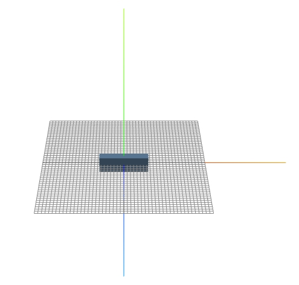
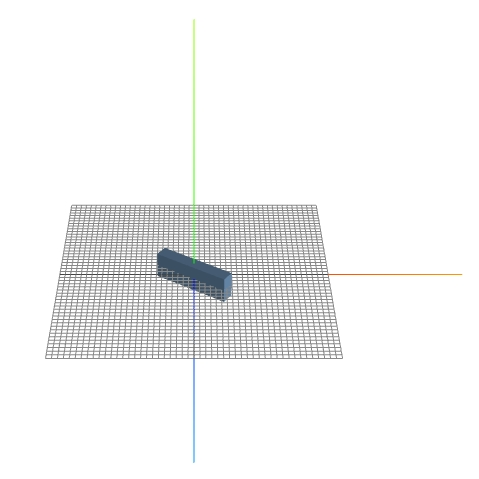
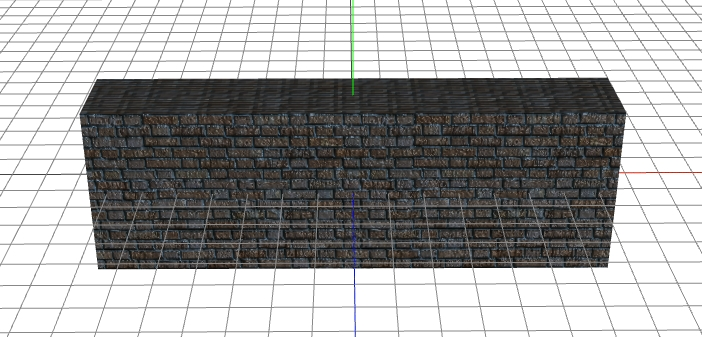
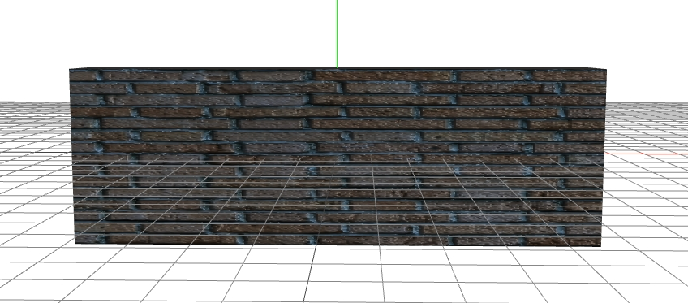
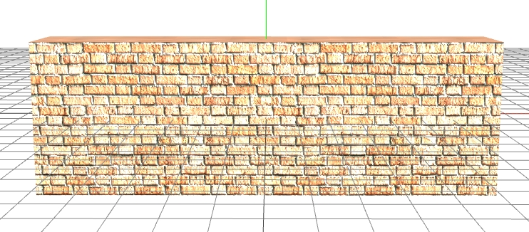
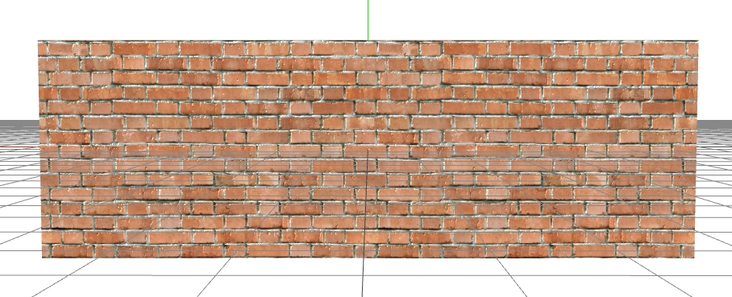

# L3D

### 版本
        0.1 DEV
### 依赖文件
         L3D.js 

### 感谢
        感谢threejs以及TWEENjs的相关开发人员
        
## 说明
        1.下载dist
        2.请自行配置服务器运行项目
        3.dist文件夹中的severce.js在本地有node环境下时，可以当做一个临时服务器，只需修改里面的路径即可。

### 用法 ###
html
```html
    <script src="js/L3D.js"></script>

    <div id="canvas-frame"></div> 
```
css
```css
    #canvas-frame{
        width:800px;
        height:350px;
    }
```
js
```javascript
    window.onload = function{
        var elementWidth = L.select("#canvas-frame").offsetWidth,
            elementHeight = L.select("#canvas-frame").offsetHeight;
        new L3D({
            el: "#canvas-frame",
            viewport: [elementWidth, elementHeight],
            render: {
                antialias: true,
                alpha: false,
            },
            camera: {
                position: [0, 240, 350],
                controls: true,
            },
            light: [{
                type: "环境光",
                position: [0, 50, 0],
                intensity: 1,
                color: "#ffffff",
                name: "light1"
            }],
            axis: {
                isOpen: true,
                length: 100
            },
            bindHandler: function (TH) {
               
            },
            ray: function (TH, obj) {
                
            },
            createObj: function (TH) {
                
            },
            animate: function (TH) {
                
            }
        });
    }      
```
### 效果演示
        详细代码见demo1.html



### 我们来介绍一下必填的属性

主属性 | 作用 | 是否必填
-|:-:|-:
el | 容器的ID或者class，例如"#id",或者".class" | 必填
viewport | 容器的宽高，[宽，高]，不能写反 | 必填
render | 定义渲染器 | 必填
camera | 定义相机 | 必填
light | 定义光照 | 必填
axis | 定义辅助坐标轴 | 必填
bindHandler | 绑定事件 | 必填
ray | 光线拾取器，可以用来创建鼠标与三维物体的交互事件 | 必填
createObj | 创建三维物体 | 必填
animate | 动画函数| 必填

### 知识讲解1
    三维世界中存在着三维坐标系，图中红线代表X轴，绿线代表Y轴，蓝线代表Z轴。
    网格代表着水平面。


### 创建一个立方体

```javascript
    ...
    createObj: function (TH) {
            TH.createBox({ 
                a: 30,
                b: 10,
                c: 5,
                x: 0,
                y: 0,
                z: 0,
                color: "#334455",
                name: "cube", 
                });

        },
    ...
```
### 效果演示
        详细代码见demo2.html



### 我们来介绍一下该例子当中用到的东西

主属性 | 作用 | 类型
-|:-:|-:
TH | 里面有所有用到的所有属性和方法，例如createBox就是里面用来创建三维立方体的函数 | function
a | 物体沿着x轴的长度 | number
b | 物体沿着y轴的长度 | number
c | 物体沿着z轴的长度 | number
x | x轴坐标 | number
y | y轴坐标 | number
z | z轴坐标 | number
color | 物体的颜色，可以是8进制和16进制,8进制不用引号 | string
name | 物体的名称 | string

### 知识讲解2
    物体被创建时默认在原点，可以改变position的值来改变位置，比如修改x,y,z的值。
    物体被创建时，按照光照效果，可以分为两大类不同的材质：
        1.可以被光照影响的材质，表面的效果会随着光照的变化而变化。
        2.不可以被光照影响的材质，不会随着光照的变化而变化。
    在V0.1DEV版本中，物体的材质都是会被光照影响的，后续的版本会完善这个地方。
    关于材质这部分，我们后续再讲。

### 给场景中添加一个灯光
```javascript
    ...
    light: [{
                type: "环境光",
                position: [0, 50, 0],
                intensity: 1,
                color: "#ffffff",
                name: "light1"
            },{
                type: "平行光",
                position: [50, 50, 0],
                intensity: 1,
                color: "#ffffff",
                name: "light2"
            }],
    ...
```

### 效果演示
        详细代码见demo3.html



    有没有发现有一点变化？

### 我们来介绍一下该例子当中用到的东西

主属性 | 作用 | 类型
-|:-:|-:
type | 灯光的类型，目前支持环境光，平行光，点光源 | string
position | 光源的位置,[x,y,z] | array
intensity | 光照强度 | number
color | 光的颜色，可以是8进制和16进制,8进制不用引号 | string
name | 光的名称 | string

### 知识讲解3
    在本例当中，加入了两种光源，环境光、平行光。
    环境光就是自然光，当场景中存在环境光时，所有物体都将表现为同样的明暗程度，不会让物体产生阴影。
    平行光是没有光照强度衰减的光源，方向由平行光的位置和原点（0，0，0）来决定，与物体的远近无关，平行光的光照强度默认是1，变化范围是0~1之间。会让物体产生阴影。
    点光源是由一个点向四面八方发散的光源，不会让物体产生阴影。

### 物体在场景当中的运动

```javascript
    ...
    animate: function (TH) {
        roa+=0.001
        TH.scene.getObjectByName("cube").rotation.y = roa
        }
    ...
```
### 效果演示
        详细代码见demo4.html



    物体是不是旋转了？

### 我们来介绍一下该例子当中用到的东西
    在本例中，TH.scene.getObjectByName("cube")，用来获取场景中的对象，cube就是之前给这个立方体起的名字，
    获取到物体之后，让它围绕Y轴旋转  rotation.y。
    我们还看到roa是个变量，会按照每秒60次的速度运行（animate中的函数都会每秒运行60次），每次都把Y轴的旋转值更新，
    连续起来就生成了动画，这也是3D世界中所有动画的原理。


### 知识讲解4
    在3D的世界中，动画的表现形式主要是位移，缩放，旋转。
    本例中的动画是旋转，通过改变物体的rotation属性，就能实现旋转效果。
    位移：position
    缩放：scale
    旋转：rotation
    这三个属性都有对应的x,y,z三个分量，改变对应的值就能产生对应的效果。

### 用图片作为物体的材质
```javascript
    ...
    TH.loaderTexture(['../images/brick_diffuse.jpg', 2, 0.5], function (texture) {
                        TH.createBox({
                            a: 30,
                            b: 10,
                            c: 5,
                            x: 0,
                            y: 0,
                            z: 0,
                            color: "#ffffff",
                            name: "cube",
                            texture: texture
                        });
                    })
    ...
```
### 效果演示
        详细代码见demo5.html



### 我们来介绍一下该例子当中用到的东西
    我们发现在createBox这个方法中多了一个属性 "texture" ，这个属性是用来加载材质的。
    TH.loaderTexture(['../images/brick_diffuse.jpg', 2, 0.5])，这个是加载材质的函数，它接收一个数组，
    [图片的路径,水平方向上对图片的拉伸，垂直方向上对图片的拉伸]

    让我们修改水平方向上对图片的拉伸，texture: TH.loaderTexture(['../images/brick_diffuse.jpg', 0.5, 0.5])

### 效果演示



    大家有没有发现，途中的材质在X方向上被拉伸了？
    

    我们把color再修改成白色 color: "#ffffff"

### 效果演示



    有没有发现颜色变化了？

    我们再换到没有平行光照的一边看看

### 效果演示



    颜色是不是又不一样？


### 结论
    材质最终显示的颜色是物体的颜色与材质的本身的颜色以及光照效果三者叠加生成的。
    如果只需要显示材质的颜色，可以把color去掉。

### 使用控制器来控制场景的一些交互

```javascript
    ...
    controls: {
                minDistance:100,//缩放时最近的距离
                maxDistance:500,//缩放时最远的距离
                minPolarAngle:0,//垂直方向上控制的最小角度
                maxPolarAngle:Math.PI/2,//垂直方向上控制的最大角度
                minAzimuthAngle:Math.PI/2,//水平方向上控制的最小角度
                maxAzimuthAngle:Math.PI,//水平方向上控制的最大角度
            }
    ...
```
### 效果演示
        详细代码见demo6.html
        
### 我们来介绍一下该例子当中用到的东西
        minDistance：缩放时最近的距离，数字，例如(100)
        maxDistance: 缩放时最远的距离，数字，例如(100)
        minPolarAngle: 垂直方向上控制的最小角度，角度,例如(Math.PI)
        maxPolarAngle: 垂直方向上控制的最大角度，角度,例如(Math.PI)
        minAzimuthAngle: 水平方向上控制的最小角度，角度,例如(Math.PI)
        maxAzimuthAngle: 水平方向上控制的最大角度，角度,例如(Math.PI)
    
